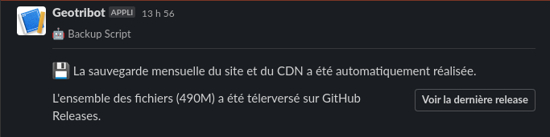
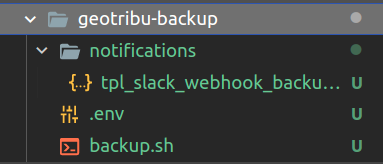

# CDN minimaliste de Geotribu

[](https://results.pre-commit.ci/latest/github/geotribu/minimalist-cdn/master)

Fichiers de configuration pour <https://cdn.geotribu.fr> et du mécanisme de sauvegarde, basé sur GitHub Release.

## Déploiement

> OS serveur : Ubuntu Server 18.04

### Prérequis

- Accès SSH au serveur

Exemple de configuration SSH :

```config
IdentitiesOnly yes

Host geotribu
    HostName elgeopaso.georezo.net
    User geotribu
    IdentityFile ~/.ssh/id_rsa_elgeopaso
```

### Tiny File Manager

1. Installer les dépendances

    ```bash
    # mise à jour de la liste des paquets
    sudo apt update
    # ajout du PPA pour avoir les dernières versions
    sudo apt install software-properties-common
    sudo add-apt-repository ppa:ondrej/php

    # installation de PHP et de ses dépendances
    sudo apt install php7.4 php7.4-zip php7.4-mbstring php7.4-fileinfo php7.4-iconv libapache2-mod-php
    ```

2. Télécharger et installer [Tiny File Manager](https://tinyfilemanager.github.io/) dans `/var/www/geotribu/cdn/`.
3. Se baser sur le fichier [./tinyfilemanager.php] de ce dépôt pour la configuration et faire les adaptations nécessaires.
4. Copier les images dans `/var/www/geotribu/cdn/images`.
5. Définir les droits :

    ```bash
    sudo chown -R geotribu:www-data /var/www/geotribu/cdn/
    sudo chmod -R 770 /var/www/geotribu/cdn/
    ```

:warning: La base de données des commentaires étant stockée dans l'arborescence, il s'agit de s'assurer que les droits sont bien adaptés. Voir : <https://github.com/geotribu/comments>.

### GitHub CLI

L'outil en ligne de commande de GitHub est utilisé pour créer des releases et téléverser les sauvegardes des fichiers statiques.

```bash
# dépendances
sudo apt install dirmngr

# ajout de la clé et du dépôt
sudo apt-key adv --keyserver keyserver.ubuntu.com --recv-key C99B11DEB97541F0
sudo apt-add-repository https://cli.github.com/packages

# installation
sudo apt update
sudo apt install gh

# clonage du dépôt du site
cd /var/www/geotribu/
git clone https://github.com/geotribu/website.git --depth=1
```

Pour finir, s'authentifier à GitHub via un Personal Token - Suivre la [documentation](https://cli.github.com/manual/).

### Script de sauvegarde

1. Copier le fichier `backup.sh` :

    ```bash
    scp backup.sh geotribu@elgeopaso.georezo.net:/home/geotribu/scripts/geotribu-backup/
    ```

2. Activer la planification via un cron

    ```bash
    crontab -e
    ```

    ```cron
    @monthly /home/geotribu/scripts/geotribu-backup/backup.sh
    ```

----

### Notification Slack

A la fin du script de sauvegarde, un message d'information est envoyé sur le Slack de Geotribu via un web hook rattaché à l'application Slack Geotribot, liée au compte d'administration de l'espace de travail.



#### Installation

1. Installer [cURL](https://curl.se/) :

    ```bash
    sudo apt install curl
    ```

2. Copier le fichier `tpl_slack_webhook_backup.json` dans un sous-dossier `notifications` à côté du fichier `backup.sh`
3. Copier le fichier `template.env`, le renommer `.env` à côté du fichier `backup.sh` et renseigner l'URL du web hook (`WEBHOOK_URL_BACKUP`)

#### Liens utiles

- interface de gestion de l'application Geotribot : <https://api.slack.com/apps/A020C9Q93BK>
- interface de conception du message : <https://app.slack.com/block-kit-builder/TUKTSG55K>

----

### Indexation des fichiers du CDN

Afin de faciliter la recherche de la bonne image lors de la rédaction des contenus, un index des fichiers du CDN est réalisé avec [lunr](https://lunrjs.com/) (son implémentation Python).

Voir [le README du sous-dossier dédié](search-index/README.md).

----

### Aperçu de l'arborescence



----

## Ressources

- Apache 2.x
- [GitHub CLI](https://cli.github.com/)
- [Tiny File Manager](https://tinyfilemanager.github.io/)
